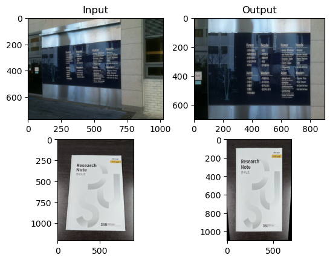

# IP2026
Image Processing (2026)

<b>Tutorial</b>

[[ tutorial_1 ]](https://github.com/Johyeonseo1/IP2026/blob/main/Tutorial/tutorial1.ipynb), 
[[ tutorial_2 ]](https://github.com/Johyeonseo1/IP2026/blob/main/Tutorial/tutorial2.ipynb), 
[[ tutorial_3 ]](https://github.com/Johyeonseo1/IP2026/blob/main/Tutorial/tutorial3.ipynb), 
[[ tutorial_5 ]](https://github.com/Johyeonseo1/IP2026/blob/main/Tutorial/tutorial5.ipynb), 
[[ tutorial_6 ]](https://github.com/Johyeonseo1/IP2026/blob/main/Tutorial/tutorial6.ipynb), 
[[ tutorial_7 ]](https://github.com/Johyeonseo1/IP2026/blob/main/Tutorial/tutorial7.ipynb), 
[[ tutorial_8 ]](https://github.com/Johyeonseo1/IP2026/blob/main/Tutorial/tutorial8.ipynb)

## chap

<b>chap 1.2</b>

  
[[ chap 1.2.1 ]](https://github.com/Johyeonseo1/IP2026/blob/main/Chapter/1.2/chap121.ipynb), 
[[ chap 1.2.2 ]](https://github.com/Johyeonseo1/IP2026/blob/main/Chapter/1.2/chap122.ipynb), 
[[ chap 1.2.3 ]](https://github.com/Johyeonseo1/IP2026/blob/main/Chapter/1.2/chap123.ipynb), 
[[ chap 1.2.4 ]](https://github.com/Johyeonseo1/IP2026/blob/main/Chapter/1.2/chap124.ipynb), 
[[ chap 1.2.5 ]](https://github.com/Johyeonseo1/IP2026/blob/main/Chapter/1.2/chap125.ipynb)

<b>chap 1.3</b>

  
[[ chap 1.3.1 ]](https://github.com/Johyeonseo1/IP2026/blob/main/Chapter/1.3/chap131.ipynb), 
[[ chap 1.3.2 ]](https://github.com/Johyeonseo1/IP2026/blob/main/Chapter/1.3/chap132.ipynb)

<b>chap 1.4</b>

  
[[ chap 1.4.1 ]](https://github.com/Johyeonseo1/IP2026/blob/main/Chapter/1.4/chap1401.ipynb), 
[[ chap 1.4.2 ]](https://github.com/Johyeonseo1/IP2026/blob/main/Chapter/1.4/chap1402.ipynb), 
[[ chap 1.4.3 ]](https://github.com/Johyeonseo1/IP2026/blob/main/Chapter/1.4/chap1403.ipynb), 
[[ chap 1.4.4 ]](https://github.com/Johyeonseo1/IP2026/blob/main/Chapter/1.4/chap1404.ipynb), 
[[ chap 1.4.5 ]](https://github.com/Johyeonseo1/IP2026/blob/main/Chapter/1.4/chap1405.ipynb), 
[[ chap 1.4.6 ]](https://github.com/Johyeonseo1/IP2026/blob/main/chap1406.ipynb),  
[[ chap 1.4.7 ]](https://github.com/Johyeonseo1/IP2026/blob/main/chap1407.ipynb), 
[[ chap 1.4.9 ]](https://github.com/Johyeonseo1/IP2026/blob/main/chap1409.ipynb), 
[[ chap 1.4.10 ]](https://github.com/Johyeonseo1/IP2026/blob/main/chap1410.ipynb), 
[[ chap 1.4.12 ]](https://github.com/Johyeonseo1/IP2026/blob/main/chap1412.ipynb), 
[[ chap 1.4.13 ]](https://github.com/Johyeonseo1/IP2026/blob/main/chap1413.ipynb)

<b>chap 1.5</b>

  
[[ chap 1.5.2 ]](https://github.com/Johyeonseo1/IP2026/blob/main/chap1502.ipynb), 
[[ chap 1.5.3 ]](https://github.com/Johyeonseo1/IP2026/blob/main/chap1503.ipynb), 
[[ chap 1.5.4 ]](https://github.com/Johyeonseo1/IP2026/blob/main/chap1504.ipynb), 
[[ chap 1.5.10 ]](https://github.com/Johyeonseo1/IP2026/blob/main/chap1510.ipynb)

<b>chap 1.6</b>

[[ chap 1.6.1 ]](https://github.com/Johyeonseo1/IP2026/blob/main/chap161.ipynb), 
[[ chap 1.6.2 ]](https://github.com/Johyeonseo1/IP2026/blob/main/chap162.ipynb), 
[[ chap 1.6.3 ]](https://github.com/Johyeonseo1/IP2026/blob/main/chap163.ipynb)

<b>chap 1.7</b>

[[ chap 1.7.1 ]](https://github.com/Johyeonseo1/IP2026/blob/main/chap171.ipynb), 
[[ chap 1.7.2 ]](https://github.com/Johyeonseo1/IP2026/blob/main/chap172.ipynb), 
[[ chap 1.7.3 ]](https://github.com/Johyeonseo1/IP2026/blob/main/chap173.ipynb), 
[[ chap 1.7.4 ]](https://github.com/Johyeonseo1/IP2026/blob/main/chap174.ipynb)

## Homework

<b>Homework 1</b>

  
[[ code ]](https://github.com/Johyeonseo1/IP2026/blob/main/Homework/homework1.ipynb)

<b>Homework 2</b>

  
[[ code ]](https://github.com/Johyeonseo1/IP2026/blob/main/Homework/homework2.ipynb)

<b>Homework 3</b>

[[ code ]](https://github.com/Johyeonseo1/IP2026/blob/main/Homework/homework3.ipynb)

<b>Homework 4</b>

  
[[ code ]](https://github.com/Johyeonseo1/IP2026/blob/main/homework4.ipynb)

<b>Homework 5</b>

  
[[ code ]](https://https://github.com/Johyeonseo1/IP2026/blob/main/homework5.ipynb)

